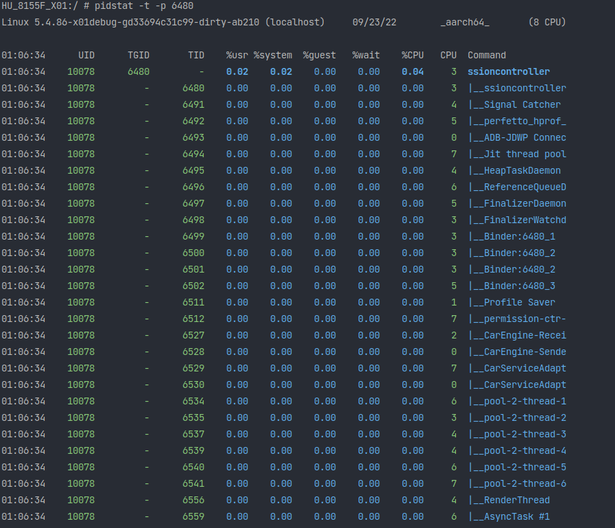
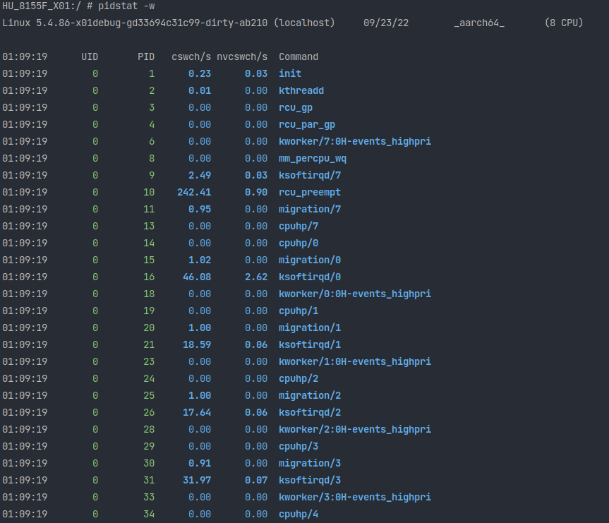
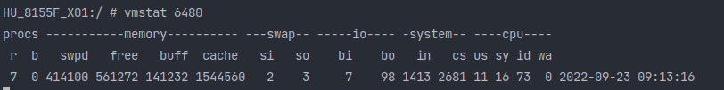
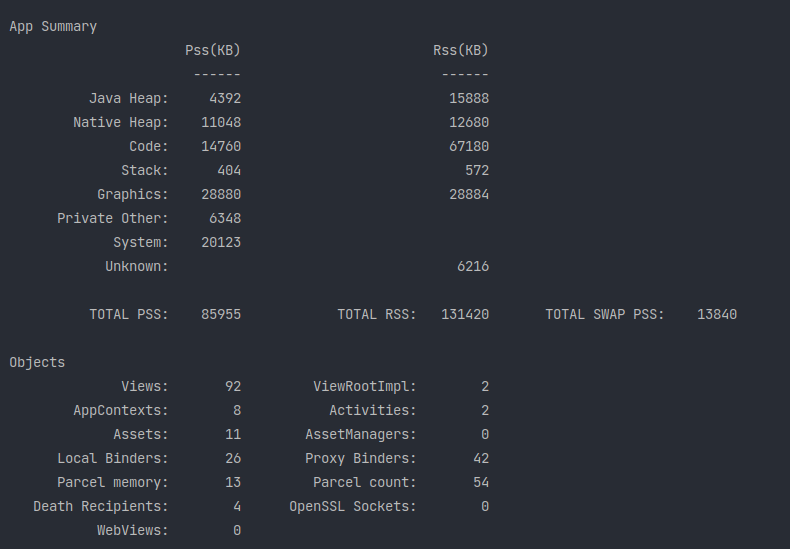
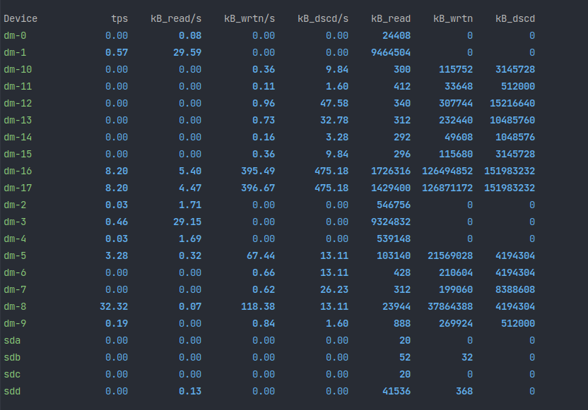

### 部门安卓培训课后练习

- # animation0810
  
  根据上面自定义ObjectAnimator属性章节中的代码示例写一个Demo，
  
  放置一个Button点击来运行该动画。动效设计师要求使用下图Cubic缓进缓出插值器，动画时长3秒。
- # photo-0815
1. 新建工程，接入Glide图片框架，做一个简单的看图软件，要求满足：
2. 显示externalStorage目录的3张本地图片
3. 显示自行寻找到的在线图片3张。
- # view-0808
1. 用paint给光柱图加一个白色边框；
2. 调整车标位置，让它在分割线上居中显示；
3. 需要考虑到车标在底部和顶部时候的处理；
4. 完善高度的绘制，需要假数据与高度进行百分比运算；
5. 把光柱图代码变为横向绘制；
6. 进阶：让光柱图支持横向绘制。通过attrs属性配置；
- # designpatterns-0802
  
  题目：广泛查阅资料，结合源代码，以知行三问为框架，写一篇心得感悟！
  
  - 印象最深的一个原则是什么，为什么？
  - 设计原则和自己的工作有那些联系？
  - 有那些行动和改变，可以用于指导后续的工作？

- # Jetpack使用
  - 利用Compose写一个简单的列表，体验一下和之前用RecyclerView展示列表的区别
  - 使用架构组件实践一下MVVM架构
> 暂未接触Kotlin

- # IPC 0831

- 实现一个运动APP,该APP有两个进程，其中主进程用来做U展示，后台进程监听GPS轨迹并对运
  动距离做累积计算，两进程通过aidl进行通讯，交互草图如下：

  

- # framework
  - 写个App，可以列出来所有已安装应用图标和应用名称，点击后打开对应应用
  - 升级版: 可以处理应用安装/卸载，通过角标或者应用名称的文字区分系统应用/三方应用

- # 系统稳定性分析 0920

  #### 写出两种oom类型error，并通过trace或heap文件进行分析，写出分析过程与结论。

  ##### 1 模拟oom: stackoverflow

  ```java
  /**
   * dushaoxiong@lixiang.com
   */
  public class OOMActivity extends AppCompatActivity {
  
      private static final String TAG = OOMActivity.class.getName();
      private static int count = 0;
  
      @Override
      protected void onCreate(Bundle savedInstanceState) {
          super.onCreate(savedInstanceState);
          setContentView(R.layout.activity_oomactivity);
  
          recursion();
      }
  
      private void recursion() {
          count++;
          Log.i(TAG, "recursion: count = " + count);
          recursion();
      }
  }
  ```

  可以看到 当count = 171001的时候，递归调用达到了默认JVM的最大栈深度。

  


##### 2 模拟OOM: javaHape out of memory

```java
/**
 * dushaoxiong@lixiang.com
 */
public class OOMJavaHeapActivity extends AppCompatActivity {

    private static final String TAG = OOMSofActivity.class.getName();

    @Override
    protected void onCreate(Bundle savedInstanceState) {
        super.onCreate(savedInstanceState);
        setContentView(R.layout.activity_oomjava_heap);
        
        int count = 0;
        ArrayList<BigObj> bigObjArrayList = new ArrayList<>();
        for (int i = 0; i < 1000000; i++) {
            count++;
            bigObjArrayList.add(new BigObj());
            Log.i(TAG, "count:" + count);
        }
    }

    private static class BigObj{
        final byte[] bytes = new byte[1024 * 1024];
    }
}
```

当count=186的时候，Java堆满，报异常没有更多空间了。


##### 3 分析过程 以heap满为例

使用as的profilter分析堆内存 发现byte类型的所占的比重最大，点进去，发现是OOMJavaHeapActivity中的BigObj对象，结合代码，就可以发现，是BigObj一直创建，list持有它的引用，导致无法GC，最终导致内存溢出。


- # 性能分析

1. ### 对自己负责的模块做个摸底，cpu，memory，io使用情况是什么样的？

   - #### cpu

用top查看所有服务


用pidstat -t -p 6480查看权限管理PermissionController的部分 



可以看到占用cpu最大的线程是ssioncontroller。跑在3核上。

查看权限管理的进程上下文切换次数



可以看到rcu_preempt这个进程主动进行了242次上下文切换，说明它这个部分有很长时间在IO操作或者网络请求上，需要注意。

- #### 内存

vmstat 6480 查看权限管理的内存使用情况



dumpsys meminfo 6480查看详细内存情况



可以看到堆中实际使用的物理内存按比例分配了4392k，包括共享库一共使用了15000k。

- #### io



1. ### 对自己负责的模块做个诊断，cpu主要消耗在什么地方了？哪里可做优化减小cpu开销？